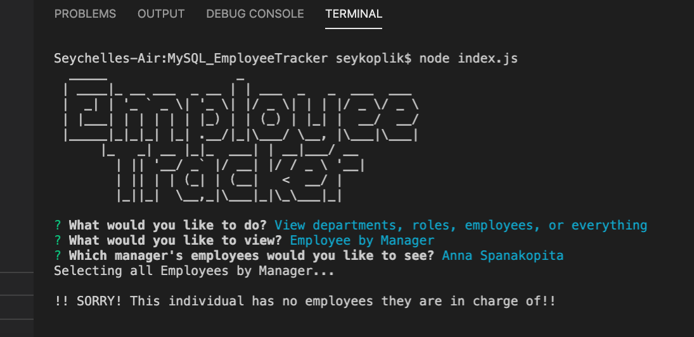
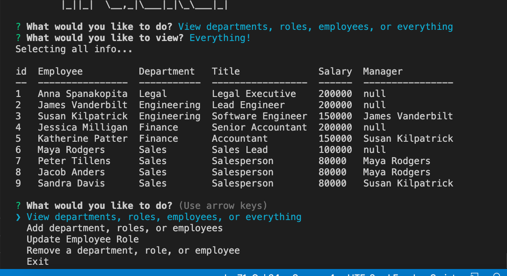

# MySQL -- Employee Tracker

[](https://opensource.org/licenses/MIT)


## Description

This is a Content Management System created for tracking Employees in a company's database. In this application, a user can do various things to keep track of employee data. With the use of node, inquirer, and MySQL is it possible to build an interface that can function as a record keeper

## Screenshots


<br>


## Installation

Inside the file folder directory... 

```
npm install inquirer mysql --save 
```
On MySQL Workbench

```
copy and paste schema.sql along with seeds.sql
```

Once database is established ...
while inside the directory of the tracker...

```
node index.js

answer questions in the prompt appropriately to process data
```

## Usage

* User can use the application to view... 
    - Department
    - Role
    - Employees
    - Employees by Department
    - Employees by Manager

* User can use application to add...
    - New Department
    - New Role
    - New Employee

* User can use application to update..
    - Employee role

## Attributes

- Node JS
- Inquirer
- MySQL
- Console.table
- Figlet 
- Dotenv

## License

MIT

## Links

<a href="https://drive.google.com/file/d/1lDKU2YeRZLe-GmXP4RKaoshsMCyZHxir/view"> Video Demo Link for Command Line Interface</a>

## Challenges/Incomplete

*** The [Remove dept, role, or employee] does not work. I keep running on an error for that section. This was a bonus section so I did not take too much time trying to figure it out before the homework was due.

-----
© 2020 Seychelle Koplik